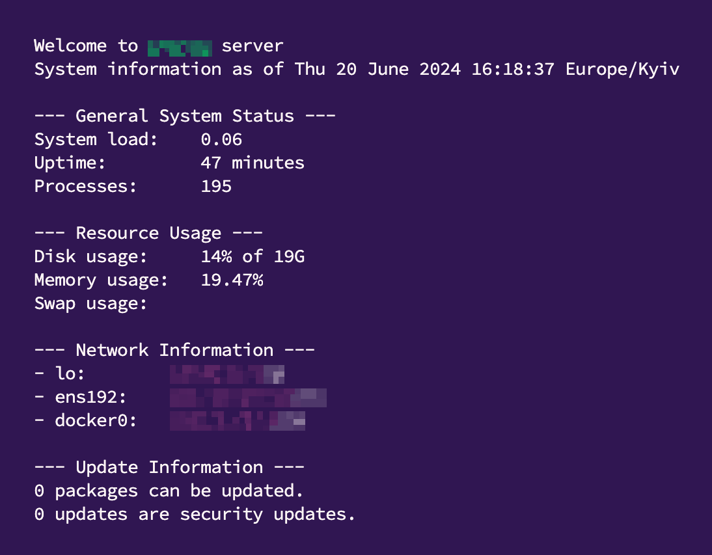

> [!NOTE]
> For installation use root
> ```
> su -
> ```
**Installation without docker**
```bash
bash <(wget -qO- https://github.com/qwqw-333/pub_w/raw/main/Utilities/debian/default_configuration/start.sh)
```
**Installation with docker**
```bash
bash <(wget -qO- https://github.com/qwqw-333/pub_w/raw/main/Utilities/debian/default_configuration/start+docker.sh)
```

_Example:_

